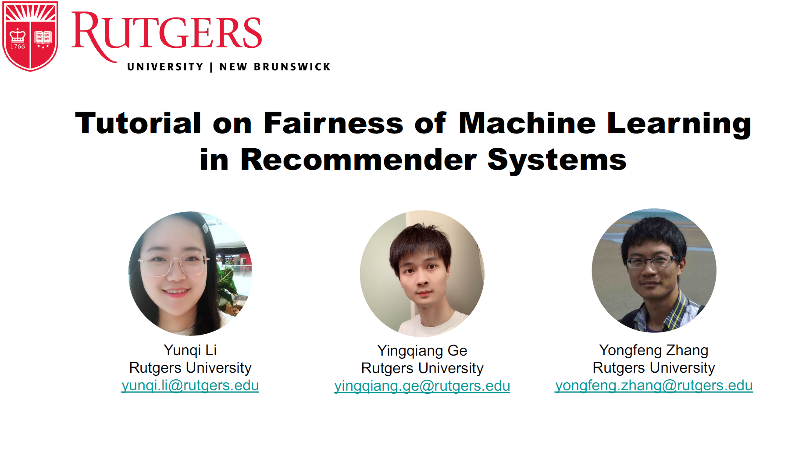

*The tutorial is delivered at SIGIR 2021.*
<!-- 
 -->
Abstract
------
Recently, there has been growing attention on fairness considerations in machine learning. As one of the most pervasive applications of machine learning, recommender systems are gaining increasing and critical impacts on human and society since a growing number of users use them for information seeking and decision making. Therefore, it is crucial to address the potential unfairness problems in recommendation, which may hurt users’ or providers’ satisfaction in recommender systems as well as the interests of the platforms. The tutorial focuses on the foundations and algorithms for fairness in recommendation. It also presents a brief introduction about fairness in basic machine learning tasks such as classification and ranking. The tutorial will introduce the taxonomies of current fairness definitions and evaluation metrics for fairness concerns.
We will introduce previous works about fairness in recommendation and also put forward future fairness research directions. The tutorial aims at introducing and communicating fairness in recommendation methods to the community, as well as gathering researchers and practitioners interested in this research direction for discussions, idea communications, and research promotions.

Outline
------
* Introduction
  * Social Impact of Recommender System and Fairness
  * Motivation of Fairness in Recommender Systems
  * Relationship with AI Ethics
  * Beyond Ethics: a Utilitarian Perspective
* Fairness in Machine Learning
  * Fairness in Classification
  * Fairness in Ranking
* Fairness in Recommendation
  * Introduction
  * Taxonomy
  * Dataset and Evaluation
  * Challenge and Opportunity

Material
------

<!--img src='/images/image-alignment-1200x4002.jpg'><br/-->

<!--iframe width="1280" height="720" src="https://www.youtube.com/embed/ekGljvAXIKE" frameborder="0" allow="accelerometer; autoplay; clipboard-write; encrypted-media; gyroscope; picture-in-picture" allowfullscreen></iframe-->

[PDF](/files/Tutorial_on_Fairness_in_Recommendation.pdf)   [Slides](/files/Tutorial_on_Fairness_in_Recommendation_Slides.pdf)
<!-- [Video](https://www.youtube.com/watch?v=RdGnJSRA0aw)  -->

Presenters
------
[Zuohui Fu](https://zuohuif.github.io/) is a Ph.D. student in the Department of Computer Science at Rutgers University, jointly advised by Prof. Yongfeng Zhang and Prof. Gerard de Melo. His research interests focus on solving the cutting-edge research problems over Information Retrieval, Natural
Language Processing and Machine Learning, with the emphasis on semantic matching, dialogue systems, and decision making over knowledge graphs, etc. His recent research mainly aims at knowledge graph assisted explainable, fair and conversational recommender system. His works have appeared in premier IR and artificial intelligenceconferences including AAAI, SIGIR, WWW, IJCAI, ACL, etc. Besides, he has served as the conference PC member in NeurIPS, AAAI, ACL, EMNLP, CIKM, etc., and the journal reviewer for ACM TOIS, etc.

[Yikun Xian](https://orcax.github.io/) is a Ph.D. student at the Department of Computer Science of Rutgers University, jointly advised by Prof. Yongfeng Zhang and Prof. Shan Muthukrishnan. His research interest broadly lies in the intersection of information retrieval and machine learning. His recent research include graph-based explainable decisionmaking problems with applications to explainable recommendation, knowledge-enhanced and explainable conversational recommendation, as well as interpretable comparative shopping. He mainly develops machine learning techniques such as graph-based reasoning, neural symbolic reasoning and deep reinforcement learning for information retrieval and recommender systems. He has served as PC member/reviewer in top computer science conference/journals such as NeurIPS, EMNLP, CIKM, SIGIR, ECML-PKDD, WWW, ECIR, RecSys, and ACM TOIS.

[Yongfeng Zhang](http://yongfeng.me/) is an Assistant Professor in the Department of Computer Science at Rutgers University (The State University of New Jersey). His research interest is in Information Retrieval, Recommender Systems, Machine Learning, and Internet Economics. In the previous he was a postdoc in the Center for Intelligent Information Retrieval (CIIR) at UMass Amherst, and did his PhD and BE in Computer Science at Tsinghua University, with a BS in Economics at Peking Univeristy. He has been consistently working on conversational recommendation, explainable recommendation, and the intersection between the two subjects. His recent work on conversational recommendation models includes learning to ask for conversational recommendation, explainable conversational recommendation, and knowledge-enhanced conversational recommendation.

[Yi Zhang](https://sites.google.com/ucsc.edu/yizhang) is a professor in the School of Engineering, University of California Santa Cruz. Her research interests include large scale information retrieval, recommendation systems, internet advertising, data mining, natural language processing, and applied machine learning. She has published chapters, journal articles, and papers at top conferences in these areas, such ACM SIGIR, WWW, CIKM, IEEE ICDM, ICML, COLINGS, HLT. She received NSF Faculty Early Career Award in 2010, an Air Force Research Young Investigator Award in 2008, the Best Paper Award at ACM SIGIR in 2002, and several other awards. Her Information Retrieval and Knowledge Management Lab is doing research sponsored by several government agencies and companies (Microsoft, Yahoo, Google, NEC, Bosch, Nokia etc.). She has served as a consultant or technical advisor for companies. She regularly serves on the program committees of the very best conferences in her research areas. She has served as area chair or senior PC member at ACM SIGIR, EMNLP, and ACM Recommender Systems. She has served as conference co-chair in charge of Information Retrieval area at the ACM Conference on Information and Knowledge Management, and tutorial chair for ACM SIGIR. She is serving as an associate editor for ACM Transaction on Information Systems. Dr. Zhang received her Ph.D. from School of Computer Science at Carnegie Mellon University, specializing in Language and Information Technologies.

<iframe width="1280" height="720" src="https://www.youtube.com/embed/RdGnJSRA0aw" frameborder="0" allow="accelerometer; autoplay; clipboard-write; encrypted-media; gyroscope; picture-in-picture" allowfullscreen></iframe>

